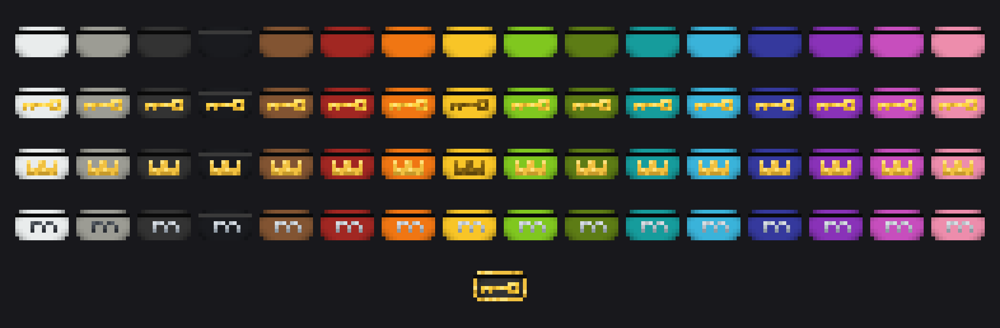

# Dynamic Keycards

[한국어 버전 (Korean version)](README_KO.md)

Keycards and player-bound card readers for redstone access control.
A NeoForge mod for Minecraft **1.21.1**.

## What it does

Place a **card reader** — it binds to you. Register a **blank card** on it and the card
becomes a keyed **keycard**; using a registered card on the reader emits a 3-second
redstone pulse. That's the whole loop: doors, vaults, and machines that only open for
the right card.

On top of that:

- **Four reader variants** — Insert, Touch, Swipe, Advanced. Identical behavior,
  different looks, four visual states each (idle / accepted / denied / register mode).
- **Fork duplication** — the Card Duplicator copies a card onto a blank one. The copy
  inherits everything the source could open *at that moment*; afterwards the two are
  completely independent cards. No remote kill-switches, no orphan-key bookkeeping.
- **Manager & Member access cards** — a manager card's registrations also apply to
  every member card it issued. Duplicate a manager onto a blank card to issue members,
  or onto a blank manager card for a co-manager. Possession is authority — no player
  binding.
- **Golden Keycard** — a skeleton key that operates any reader and can arm register
  mode on readers you don't own (creative-only for now).
- **Per-card control** — one press in register mode always toggles exactly the card
  you're holding: accepted cards get removed, rejected cards get registered. Related
  copies are never affected. (Member cards are exempt — they're managed only through
  their manager card.)
- **Audible feedback** — high bell = pass, bright pling = registered, low pling =
  removed/cancelled, low bass = denied. Vanilla note-block tones, no custom assets.
- **Dye recycling** — craft any card with a dye to reset it into that color's blank
  card.

## Integrations (all optional)

| Mod | What you get |
|---|---|
| **EMI** | The machine processes as recipe categories: Card Registering (blank/keycard → keycard, per color) and Card Duplicating (fork / issue member / co-manager, per color), laid out Create-style with the machine shown as a hoverable catalyst. |
| **Jade** | Readers show their owner and register-mode state; duplicators show whether a copy is pending. |

Localized in **7 languages**: English, 한국어, 日本語, Deutsch, Español, Nederlands, 中文(简体).

## Documentation

- [User manual](MANUAL.md) ([한국어](MANUAL_KO.md)) — every interaction, status light,
  and recipe in one place.
- [Changelog](CHANGELOG.md) — full version history.

## Progress

| Version | Highlights |
|---|---|
| 0.0.1 | Four reader variants, 16 colored keycards with unique keys, player binding, redstone pulse, golden keycard, 7-language localization |
| 0.0.2 | Card Duplicator, unregister, golden full reset, user manual |
| 0.0.3 | Snapshot-fork duplication, per-card register/remove toggling |
| 0.0.4 | Manager/member cards, co-managers, registration cap config |
| 0.0.5 | Blank cards split from keycards — unkeyed vs keyed at a glance |
| 0.0.6 | Card family rename; every item type in the creative tab |
| 0.0.7 | EMI recipe-viewer integration |
| 0.0.8 | Naming corrections; EMI recipes for every color |
| 0.0.9 | Feedback tones, Jade support, crown manager texture, plain-language descriptions |
| 0.1.0 | New blank card recipe |

## Requirements

- Minecraft 1.21.1
- NeoForge 21.1.233+

## Community

- [Issue tracker](https://github.com/merubox/DynamicKeycards/issues) — bug reports and
  feature requests (templates provided).
- [Discord](https://discord.gg/KDejhW2JDA)

## License

MIT
